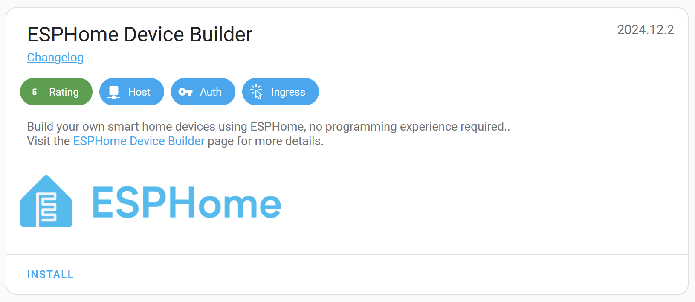
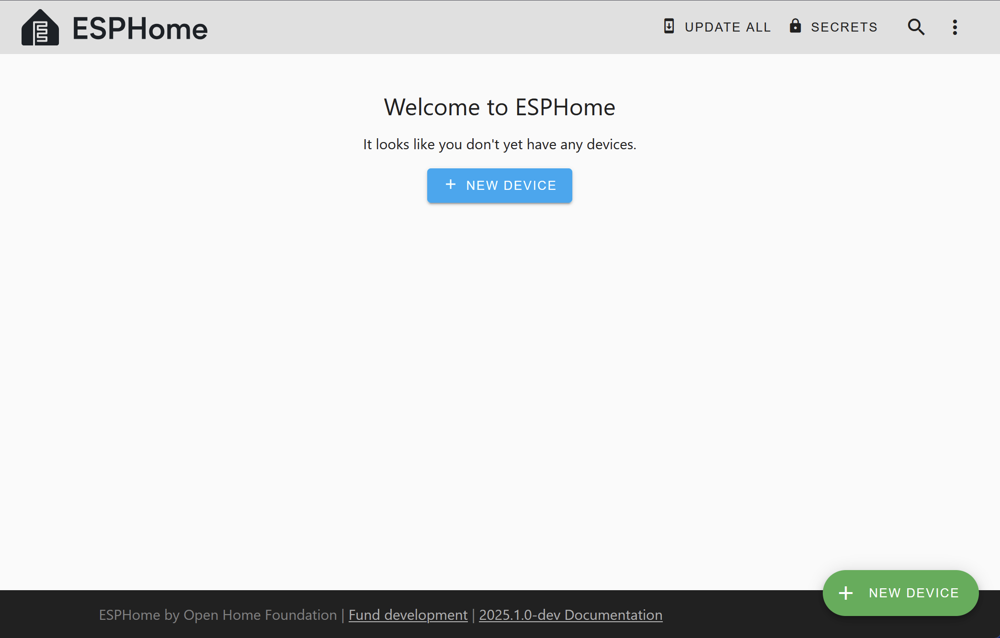
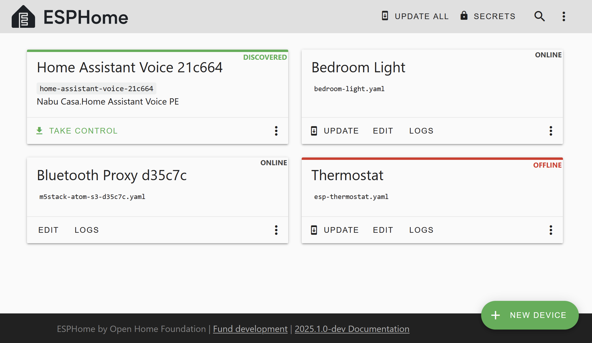

Getting Started with ESPHome and Home Assistant
===============================================

.. seo::
    :description: Getting Started guide for installing ESPHome Device Builder as a Home Assistant add-on and creating a basic configuration.
    :image: home-assistant.svg

In this guide, we'll walk you through how to install ESPHome onto a device/microcontroller using the ESPHome Device
Builder, installed as a Home Assistant add-on.

This is generally the easiest way to get started with ESPHome.

Introduction to ESPHome
-----------------------

ESPHome allows you to create "configurations" which allow you to turn common microcontrollers into smart home devices.

A device "configuration" consists of one or more `YAML files <https://en.wikipedia.org/wiki/YAML>`__  and, based on the
content of the file(s), ESPHome creates custom firmware which you can then install directly onto your device. Hardware
defined in the configuration--such as sensors, switches, lights, and so on--will automatically appear in Home
Assistant's user interface.

Note that there are two "parts" to ESPHome:

- The part which runs on the device/microcontroller, and...
- The part which runs on your computer system, whether that's a single-board computer (SBC) such as a Raspberry Pi or
  a laptop/desktop-class system.

The ESPHome Device Builder provides a simple web user interface (UI) which allows you to create, edit and install your
device configurations onto your devices.

Installing ESPHome Device Builder
---------------------------------

To install the ESPHome Device Builder in Home Assistant, click the following button:

.. raw:: html

    

This should open the ESPHome add-on page; once you're there, just click the INSTALL button:

Installation of the add-on may take a moment or two. Once done, click "Start" and then click "Open Web UI".

.. note::

    If you're running Home Assistant in a way that does not provide access to add-ons, you may
    :ref:`run the ESPHome Device Builder independently in Docker<esphome-device-builder-docker>`.

The web UI will present a wizard which will walk you through creating your first configuration:

After creating your first configuration, you'll need to install it on your device.

.. note::

    The initial installation of ESPHome onto a new device is often the most difficult and/or intimidating part -- at
    least until you've done it a few times.

    If you haven't done this before, please see :doc:`physical_device_connection`.

If you didn't do so when prompted upon creating your first device, you'll need to enter your Wi-Fi network credentials
immediately following installation so that your device can connect to your Wi-Fi network and subsequently communicate
with Home Assistant.

.. _esphome-interface:

Device Builder Interface
------------------------

Let's take a quick tour of the ESPHome Device Builder interface.

The main page displays a list of all configuration files for nodes you've created. For each file, there are a few
actions you can perform:

- **UPDATE**: This button appears when the device is running an ESPHome version which is older than that available in
  the ESPHome Device Builder add-on.
- **EDIT**: This will open the configuration editor.
- **LOGS**: This allows you to view logs emitted by the device. If a device is connected via USB, you can choose to use
  the USB/serial connection; otherwise, it will attempt to connect to the device and (once connected) display the logs
  via the Wi-Fi connection.
- **Overflow menu**: This is a dropdown menu which allows you to perform some additional actions. Of note are:

  - **Validate**: This will validate the configuration file.
  - **Install**: Opens the Install dialog.
  - **Clean Build Files**: This will delete all of the generated build files; it can help to resolve compile issues
    should they occur. *This is safe to perform at any time and you should try this before reporting bugs or other
    issues.*
  - **Delete**: This will delete the configuration file.

The configuration files for ESPHome are stored in the ``<HOME_ASSISTANT_CONFIG>/esphome/`` directory. For example, the
configuration for the "Bedroom Light" node in the picture above can be found in ``/config/esphome/bedroom-light.yaml``.

.. note::

    Home Assistant add-ons run as individual containers; this can make accessing your configuration files/logs a bit
    challenging. If you wish to do so, you'll need to install Home Assistant's
    `SSH add-on <https://www.home-assistant.io/common-tasks/os/#installing-and-using-the-ssh-add-on>`__, configure it
    with a username and password and also disable "Protection Mode" (please assess the risks associated with doing so).

    Finally, to access the logs from a device through an SSH client, you can log in and use a command like
    ``docker exec -it addon_15ef4d2f_esphome esphome logs /config/esphome/bedroom-light.yaml``.

    See :doc:`getting_started_command_line` for more detail.

Adding Features
---------------

After stepping through the wizard, you should have a device configuration (YAML) file. In the ESPHome Device Builder,
click on "EDIT" to open that file and add a :doc:`GPIO switch</components/switch/gpio>` to the configuration like this:

.. code-block:: yaml

    switch:
      - platform: gpio
        name: "Living Room Dehumidifier"
        pin: GPIO5

In Home Assistant, the example code above will look like this:

.. figure:: /components/switch/images/gpio-ui.png
    :align: center
    :width: 75.0%

In the example above, we're simply adding a switch that's called "Living Room Dehumidifier" and is connected to the pin
``GPIO5``. This switch could really control anything -- lights or a tabletop fan, for example. Its name and function is
arbitrary and should be set as is appropriate for your particular application.

Adding A Binary Sensor
----------------------

Next, let's add a :doc:`binary sensor which will monitor a GPIO pin </components/binary_sensor/gpio>` to determine and
report its state.

.. code-block:: yaml

    binary_sensor:
      - platform: gpio
        name: "Living Room Window"
        pin:
          number: GPIO0
          inverted: true
          mode:
            input: true
            pullup: true

In Home Assistant, the example code above will look like this:

.. figure:: /components/binary_sensor/images/gpio-ui.png
    :align: center
    :width: 75.0%

After adding this to your device's configuration file, be sure to click "SAVE" to save the changes you've made to your
configuration...and read on to the next section!

Updating your Device
--------------------

Any time you make changes to your device's configuration file, you'll need to update the associated physical device
with your modified configuration. Put another way, just saving the configuration file alone does not update the
ESPHome device with the changes you've made.

Each time you modify a device's configuration file, you need to update the device by clicking **INSTALL** to recompile
and reinstall your updated configuration onto the device.

Note that you won't need to have the device connected to your system with a USB data cable again, as (once ESPHome is
installed on your device) it can update the device :doc:`"over the air" </components/ota/index>`.

.. _connecting-your-device-to-home-assistant:

Connecting your device to Home Assistant
----------------------------------------

Once your configuration is installed on your device and it's connected to your Wi-Fi, Home Assistant will automatically
discover it (assuming your network permits this) and offer to configure it:

.. raw:: html

    

Alternatively, you can manually add the device on the Home Assistant Integrations page. To do so, click on the "Add
Integration" button (bottom right), search for "ESPHome" and enter the ESPHome device's host name. The host name is
based on the name you've given to the device; if you named your device "living-room-lamp", its host name will be
``living-room-lamp.local``. You can also enter the device's IP address, if for some reason you prefer to use that.

You can repeat this process for each ESPHome device.

Where To Go Next
----------------

Great! 🎉 You've successfully set up your first ESPHome project and installed your first ESPHome custom firmware to your
device. You've also learned how to enable some basic components via the configuration file.

Now is a great time to go take a look at the :doc:`Components Index </index>`. Hopefully you'll find all the hardware
components you need there. If you're having any problems or want to request new features, please either create a new
issue on the `GitHub issue tracker <https://github.com/esphome/issues/issues>`__ or find us on the
`Discord chat <https://discord.gg/KhAMKrd>`__. Be sure to read the :doc:`FAQ <faq>`, as well!

See Also
--------

- :doc:`ESPHome index </index>`
- :doc:`getting_started_command_line`
- :ghedit:`Edit`
